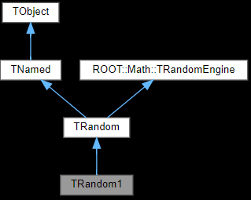

# Adding a class

> ⚠️Warning⚠️  
> As the project evolves, some of the information in this document may become outdated, please use other already existing classes as a reference.

Let's say we want to add the `TRandom1` class to our project.

## Adding the C bindings

<!-- TODO add link -->
Create a new file `include/root-rs-c-bindings/TRandom1.h` and `src/TRandom1.cpp`. Add the following content to `include/root-rs-c-bindings.h`:
```c
#include "root-rs-c-bindings/TRandom1.h"
```

Save the `CMakeLists.txt` file to make sure VSCode reloads it, otherwise we will not have code completion for the new files.

We now open the [`TRandom1` documentation](https://root.cern/doc/v630/classTRandom1.html) and we find the following inheritance diagram:



We observe that `TRandom1` inherits from `TRandom`. We then open `include/root-rs-c-bindings/TRandom1.h` and add the following content:
```cpp
#pragma once

struct TRandom1;
struct TRandom* root_rs_TRandom1__as_TRandom(struct TRandom1* random);
struct TRandom1* root_rs_TRandom1__from_TRandom(struct TRandom* random);
void root_rs_TRandom1__delete(struct TRandom1* random);
```
Here, the `*_as_*` and `*_from_*` are will be used by the rust code to perform casting while the `*_delete` function will be used to delete the object.

We then open `src/TRandom1.cpp` and add the following content:
```cpp
#include <root-rs-c-bindings.h>
#include <TRandom1.h>

extern "C" {
    TRandom* root_rs_TRandom1__as_TRandom(TRandom1* random) {
        return random;
    }

    TRandom1* root_rs_TRandom1__from_TRandom(TRandom* random) {
        return dynamic_cast<TRandom1*>(random);
    }

    void root_rs_TRandom1__delete(TRandom1* random) {
        delete random;
    }
}
```

## Updating the Rust side

We add a new file named, for example, `src/core/random_1.rs` and declare it in the parent module.

We then add the following content to `src/core/random_1.rs`:
```rust
use super::*;

root_object! {
    /// Some documentation
    TRandom1: TRandom, // <- a list of parent classes here

    // Here we define some shortcuts for up-casting:
    ref
    // <parent> : <path to parent>
    TNamed: TRandom,
    TObject: TRandom => TNamed,
    TRandomEngine: TRandom,
}
```

The `ref` section will add some shortcuts to up-cast the object to its parent classes. We have to do it manually since C++ supports _diamond inheritance_ and multiple paths might lead to the same parent class. This would make it difficult to automatically generate the code.  
With this, users can now do:
```rust
random_1.as_TOject()
```
instead of:
```rust
let random = random_1.as_TRandom();
let named = random.as_TNamed();
random.as_TObject()
```

## Adding more methods

Let's say we want to add a `foo` method.

In the header, we add the following:
```cpp
void root_rs_TRandom1__foo(struct TRandom1* random);
```

In the source file, we add the following:
```cpp
void root_rs_TRandom1__foo(TRandom1* random) {
    random->foo();
}
```

We then update the Rust side:
```rust
use super::*;

root_object! {
    TRandom1: TRandom,
    ...
}

impl TRandom1 {
    /// Some documentation
    pub fn foo(&self) {
        unsafe {
            root_rs_TRandom1__foo(self.ptr());
        }
    }
}
```